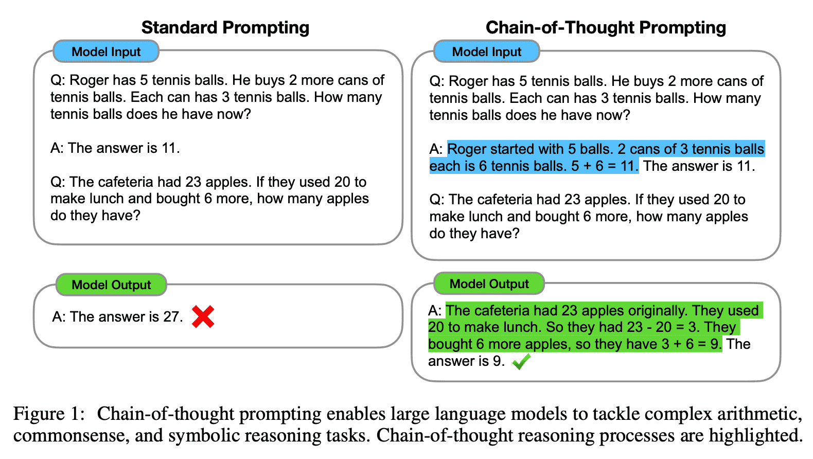



## Adaptation Options

Here's the problem statement: **Adapt a general-purpose LLM so it can accurately answer questions in a specific domain using additional documents**.

There are three general approaches: fine-tuning, prompt engineering, and retrieval-augmented generation (RAG).


graph LR
    A[General-Purpose LLM] --> B[Fine-tuning]
    A --> C[Prompt Engineering]
    A --> D[Retrieval-Augmented Generation]

    B --> B1[Adapt model weights for domain-specific tasks]
    C --> C1[Craft specialized prompts without changing model]
    D --> D1[Retrieve relevant documents to augment context]

    style A fill:#e1f5ff
    style B fill:#fff4e1
    style C fill:#fff4e1
    style D fill:#fff4e1


Let's go through each of these approaches in turn, starting with fine-tuning.

### Fine-tuning

This is where you train the LLM on domain specific data to improve its performance on a specific task.
Remember: the LLM has been trained on most of the Internet text but it doesn't know you're business or use case!


graph LR
    A[General-purpose LLM] --> B{Training Algorithm}
    C[(Document database PDFs, Images, HTMLs, etc.)] <--> B
    B --> D[Specialized LLM]

    style A fill:#e8e8e8,stroke:#333,stroke-width:2px
    style B fill:#fff,stroke:#333,stroke-width:2px
    style C fill:#fff,stroke:#333,stroke-width:2px,stroke-dasharray: 5 5
    style D fill:#c8f0c8,stroke:#333,stroke-width:2px


But training the algorithm means changing the parameters in the original model.
There are really two choices here:

**Update all the parameters**: Train the entire model from scratch or fine-tune a pre-trained model on your specific task.

This is not at all practical because LLMs have billions of parameters, which can take days or weeks to train, just to include our extra context data.
As such, it's not something an AI Engineer would consider unless you work for a large organization with significant resources.

[**Parameter Efficient Fine Turning (PEFT) Model adaptation**](https://arxiv.org/abs/1902.00751) is what most modern LLMs do because it only retrains a tiny percentage of the model, thus being faster, using less compute, and being cheaper.

There are several types of PEFT available to us:


graph LR
    PEFT[PEFT] --> Adapters
    PEFT --> LoRA
    PEFT --> PromptTuning[Prompt tuning]
    PEFT --> ActivationScalers[Activation scalers]
    PEFT --> BiasOnly[Bias-only]
    PEFT --> SparseWeightDeltas[Sparse weight deltas]

    classDef highlight fill:#ffeb3b,stroke:#333,stroke-width:2px
    class Adapters,LoRA highlight


Adapters and LoRA are by far the most popular.
Papers for most of the others are listed below.

#### Adapters

This works by adding small trainable adapter layers to these transformer blocks, typically targeting the attention mechanisms. This means instead of updating billions of parameters throughout the entire model, you only train a few million parameters in the adapters.


graph BT
    subgraph Block1[Block 1]
        Adapter1[Adapter 1]
        MLP1[MLP]
        Attn1[Attention]
        Attn1 --> MLP1
        MLP1 --> Adapter1
    end

    subgraph Block2[Block 2]
        Adapter2[Adapter 2]
        MLP2[MLP]
        Attn2[Attention]
        Attn2 --> MLP2
        MLP2 --> Adapter2
    end

    Dots2[...]

    subgraph BlockN[Block N]
        AdapterN[Adapter N]
        MLPN[MLP]
        AttnN[Attention]
        AttnN --> MLPN
        MLPN --> AdapterN
    end

    Block1 --> Block2
    Block2 --> Dots2
    Dots2 -.-> BlockN

    style AdapterN fill:#ff9999,stroke:#333,stroke-width:2px
    style Adapter2 fill:#ff9999,stroke:#333,stroke-width:2px
    style Adapter1 fill:#ff9999,stroke:#333,stroke-width:2px
    style MLPN fill:#f0f0f0,stroke:#333,stroke-width:1px
    style AttnN fill:#f0f0f0,stroke:#333,stroke-width:1px
    style MLP2 fill:#f0f0f0,stroke:#333,stroke-width:1px
    style Attn2 fill:#f0f0f0,stroke:#333,stroke-width:1px
    style MLP1 fill:#f0f0f0,stroke:#333,stroke-width:1px
    style Attn1 fill:#f0f0f0,stroke:#333,stroke-width:1px
    style Dots2 fill:none,stroke:none


The red **Adapter** modules are small, trainable layers added to each block. During PEFT training, the original model weights (Attention and MLP a.k.a Feed-Forward) remain **frozen**, while only the adapter weights are updated. This dramatically reduces:
- Training time
- Computational resources needed
- Storage requirements (you only save the small adapter weights, not the entire model)

##### LoRA

[LoRA (Low-Rank Adaptation of Large Language Models)](https://arxiv.org/abs/2106.09685) is a PEFT method that works by **adding** small trainable adapter layers to these transformer blocks, typically targeting the liner layers within the Feed Forward mechanism of transformer blocks.
This is different from Adapters, which adapt a subset of existing parameters.

As a refresher, here's what the FFN / MLP for each transformer looks like.


graph BT
    subgraph MLP[" "]
        direction BT
        Input["[x1, x2, ..., xd]"]
        Linear1["Linear 1 (W1)"]
        Linear2["Linear 2 (W2)"]
        Output["[y1, y2, ..., yd]"]

        Input --> Linear1
        Linear1 --> Linear2
        Linear2 --> Output
    end

    subgraph Detail[" "]
        direction BT
        X["x ∈ ℝ^d_in"]
        W["Pretrained Weights W ∈ ℝ^(d_out × d_in)"]
        Y["y ∈ ℝ^d_out"]

        X --> W
        W --> Y
    end

    Linear1 -.->|"Linear layer:"| W

    style Input fill:#c8e6c9,stroke:#333,stroke-width:2px
    style Output fill:#bbdefb,stroke:#333,stroke-width:2px
    style X fill:#c8e6c9,stroke:#333,stroke-width:2px
    style Y fill:#bbdefb,stroke:#333,stroke-width:2px
    style W fill:#e1bee7,stroke:#333,stroke-width:2px


The Pretrained Weights are just a matrix of size d_out × d_in.

Now let's see how LoRA adds a layer to this:


graph BT
    X["x ∈ ℝ^d_in"]

    X --> W
    X --> BMatrix

    W["Pretrained Weights W ∈ ℝ^(d_out × d_in)"]

    subgraph LoRA["LoRA layer"]
        BMatrix["B ℝ^(d_r × d_in)"]
        AMatrix["A ℝ^(d_out × d_r)"]
        BMatrix --> AMatrix
    end

    W --> Plus["(+)"]
    AMatrix --> Plus

    Plus --> Y["y ∈ ℝ^d_out"]

    style X fill:#c8e6c9,stroke:#333,stroke-width:2px
    style Y fill:#bbdefb,stroke:#333,stroke-width:2px
    style W fill:#e1bee7,stroke:#333,stroke-width:2px
    style BMatrix fill:#c8e6c9,stroke:#333,stroke-width:2px
    style AMatrix fill:#bbdefb,stroke:#333,stroke-width:2px
    style Plus fill:#fff,stroke:#333,stroke-width:2px


What LoRA does is introduce a low-rank approximation of the weights matrix, which allows for efficient fine-tuning of the model without needing to retrain the entire model from scratch.

> Those two new matrices are _learnable_ meaning that they can be trained without requiring the entire model to be retrained.

### Prompt Engineering

* Few-shot Prompting. Showing the LLM some representative examples of the task at hand, **and** including the specific prompt we want an answer to.
 It basically guides the generation process.
* Zero-shot Prompting. Providing the LLM with a prompt that it can use to generate a response without any examples.
  For example, changing _"How can I learn ML?" to "Q: How can I learn ML? A: "_ is enough to structure the response. Or adding _"Return only JSON like {"years_experience": <number> } for the resume."_
* [Chain of Thought (COT)](https://arxiv.org/abs/2201.11903).
  COT significantly improves results for logical or mathematical reasoning.
  A [subsequent paper](https://arxiv.org/abs/2205.11916) showed that just by adding _"Let's think step by step"_ to the prompt, even single-shot prompting would work better.

  

Putting this all together, we could add a system prompt for a customer support chat bot that reads the support policies first and _then_ asks the user question:


graph LR
    Question["What is the refund policy?"] --> PE["Prompt Engineering"]
    PE --> Documents["Read the following documents and respond to question.  [text from document 1] [text from document 2] ... [text from document N]  Question: What is the refund policy?"]
    Documents --> LLM["LLM"]
    LLM --> Answer["You can return items for any reason within 30 days of your purchase"]

    style PE fill:#ffeb3b,stroke:#333,stroke-width:2px
    style LLM fill:#e0e0e0,stroke:#333,stroke-width:2px


### Retrieval Augmented Generation (RAG)

The problem with our prior example (system prompt) is that reading the support policies could easily exceed the maximum number of input tokens supported by the LLM.
Basically, the knowledge is too big to read into a prompt.
That's where retrieval augmented generation (RAG) comes in.

Retrieval is a search problem:

* **Pre-process.** Build a searchable index from documents.
* **Runtime.** Search from the index at runtime.

#### Build the searchable index

* **Document parsing.** From structured or unstructed to the text that the LLM can understand.
  Parsing is mostly done using AI these days.
  [dedoc](https://github.com/ispras/dedoc) is a popular tool for document parsing.
* **Document Chunking.** If one source is a book, it will exceed the context window of LLMs (max tokens) and will be too complicate.
  By chunking using length, regex, or HTML/Markdown splitting, can get more manageable and even intelligent splitting of long documents.
  HTML/Markdown splitters tend to preserve the semantic structure of the document, like headers, etc.
  Check out [text spliters by LangChain](https://python.langchain.com/docs/concepts/text_splitters/).
* Indexing. Vector-based is the most common way today.
  KB-based indexing is specific some certain domains.
  Text-based methods - they are simple and easy to implement using something like ElasticSearch. However, they lose the semantic meaning and synonyms.
  Vector-based methods - they are more complex and require more resources, but they preserve the semantic meaning and synonyms.



## LLM Resources: Organized by Topic

The first part is all about parameter-efficient fine-tuning (PEFT)and model adaptation.
Adapters and LoRA are both parameter-specific fine-tuning methods.

### Fine-Tuning & Model Adaptation

**Foundational Papers:**
- [Parameter-Efficient Transfer Learning for NLP](https://arxiv.org/abs/1902.00751)
- [LoRA: Low-Rank Adaptation of Large Language Models](https://arxiv.org/abs/2106.09685)

**Implementation Tools:**
- [HuggingFace PEFT (Parameter-Efficient Fine-Tuning)](https://github.com/huggingface/peft)

### Prompting Techniques

**Research Papers:**
- [Chain-of-Thought Prompting Elicits Reasoning in Large Language Models](https://arxiv.org/abs/2201.11903)
- [Large Language Models are Zero-Shot Reasoners](https://arxiv.org/abs/2205.11916)

**Guides & Resources:**
- [Prompt Engineering Guide](https://www.promptingguide.ai/)

### Document Processing & Text Preparation

**Document Parsing:**
- [Dedoc: Universal PDF/document extractor](https://github.com/ispras/dedoc)
- [Layout-Parser: Document layout analysis](https://github.com/Layout-Parser/layout-parser)

**Text Chunking:**
- [Langchain Text Splitters](https://python.langchain.com/docs/concepts/text_splitters/)

### Embeddings & Vector Representations

**Foundational Research:**
- [Efficient Estimation of Word Representations in Vector Space (Word2Vec)](https://arxiv.org/abs/1301.3781)

**Embedding APIs & Models:**
- [OpenAI's Embeddings Guide](https://platform.openai.com/docs/guides/embeddings)
- [The Best Embedding Models for Information Retrieval in 2025](https://www.datastax.com/blog/best-embedding-models-information-retrieval-2025)

**Multimodal Embeddings:**
- [OpenAI's CLIP: Connecting text and images](https://openai.com/index/clip/)

### Vector Search & Retrieval

**Vector Databases & Search:**
- [Faiss: Library for efficient similarity search](https://github.com/facebookresearch/faiss)

**RAG Techniques:**
- [RAFT: Retrieval Augmented Fine-Tuning](https://arxiv.org/abs/2403.10131)

## Appendix - Quick Refresher on Transformers

Modern LLMs are built from stacked transformer blocks, where each block contains two main components:

- **Attention**: The mechanism that allows the model to focus on different parts of the input when processing each token
- **MLP (Multi-Layer Perceptron)**: Also called **the feed-forward network (FFN)**, this processes each token independently using learned transformations.
It's where the 'knowledge' is stored.


graph TB
    subgraph BlockN[Block N]
        MLPN[MLP]
        AttnN[Attention]
        AttnN --> MLPN
    end

    Dots[...]

    subgraph Block2[Block 2]
        MLP2[MLP/FFN]
        Attn2[Attention]
        Attn2 --> MLP2
    end

    subgraph Block1[Block 1]
        MLP1[MLP/FFN]
        Attn1[Attention]
        Attn1 --> MLP1
    end

    Block1 --> Block2
    Block2 --> Dots
    Dots -.-> BlockN

    style MLPN fill:#f0f0f0,stroke:#333,stroke-width:1px
    style AttnN fill:#f0f0f0,stroke:#333,stroke-width:1px
    style MLP2 fill:#f0f0f0,stroke:#333,stroke-width:1px
    style Attn2 fill:#f0f0f0,stroke:#333,stroke-width:1px
    style MLP1 fill:#f0f0f0,stroke:#333,stroke-width:1px
    style Attn1 fill:#f0f0f0,stroke:#333,stroke-width:1px
    style Dots fill:none,stroke:none


Each MLP layer consists of two linear transformations with a non-linear activation function in between. The MLP takes input vectors and transforms them through learned weight matrices:


graph TB
    Input["[x1, x2, ..., xd]"]

    subgraph MLP["MLP/FFN"]
        Linear1["Linear 1 (W1)"]
        Linear2["Linear 2 (W2)"]
        Linear1 --> Linear2
    end

    Output["[y1, y2, ..., yd]"]

    Input --> Linear1
    Linear2 --> Output

    style Input fill:#fff,stroke:#333,stroke-width:1px
    style Linear1 fill:#f0f0f0,stroke:#333,stroke-width:2px
    style Linear2 fill:#f0f0f0,stroke:#333,stroke-width:2px
    style Output fill:#fff,stroke:#333,stroke-width:1px


The MLP typically expands the dimensionality in the first layer (Linear 1) and then projects it back down in the second layer (Linear 2). This is where much of the model's learned knowledge is stored.
