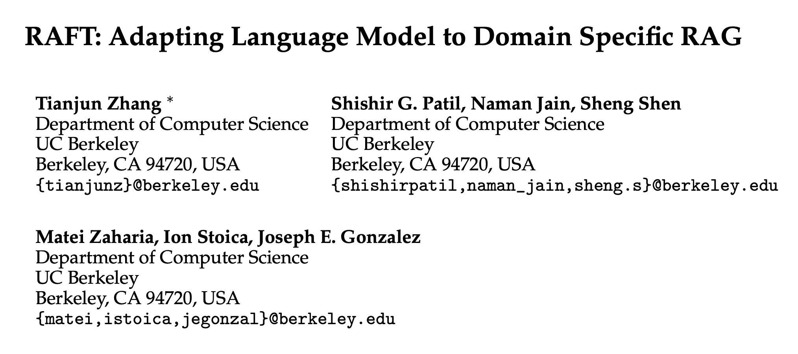

Part of the AI Engineering course I'm doing covered RAFT (Retrieval-Augmented Fine-Tuning) but I really didn't understand.

What if your LLM has access to the right documents, but it still gives lousy answers.
Maybe it gets distracted by irrelevant information.
Maybe it can't tell which document actually has the answer.
Maybe it just makes stuff up anyway.

RAFT (Retrieval-Augmented Fine-Tuning) is a training technique that helps fix this.
Instead of just memorizing facts through fine-tuning, you teach the model to be a better reader of retrieved context.

The abstract from the original paper is a good starting point:

> Pretraining Large Language Models (LLMs) on large corpora of textual data is now a standard paradigm. When using these LLMs for manydownstream applications, it is common to additionally incorporate new information into the pretrained model either through RAG-based-prompting, or finetuning.
> However, the best methodology to incorporate information remains an open question.
> In this paper, we present Retrieval Augmented Fine Tuning (RAFT), a training recipe which improves the model’s ability to answer questions in "open-book" in-domain settings.
> In training RAFT, given a question, and a set of retrieved documents, we train the model to ignore those documents that don’t help in answering the question, which we call, distractor documents.
> RAFT accomplishes this by citing verbatim the right sequence from the relevant document to help answer the question.
> This coupled with RAFT’s chain-of-thought-style response helps improve the model’s ability to reason.
> In domain specific RAG, RAFT consistently improves the model’s performance across PubMed, HotpotQA, and Gorilla datasets, presenting a post-training recipe to improve pre-trained LLMs to in-domain RAG.
>
> [RAFT: Adapting Language Model to Domain Specific RAG](https://arxiv.org/pdf/2403.10131)

## The Core Idea

Standard fine-tuning updates model weights based on training data. You're essentially burning knowledge into the model's neurons. RAFT does something different: it trains the core LLM to navigate and extract information from documents that get retrieved at runtime.

Think of it this way:
- **Standard fine-tuning**: Teaching someone facts from a textbook.
  Better training.
- **RAFT**: Teaching someone how to skim through a library and find the right answers
  Better retrieving.

## What Makes RAFT Different

The key insight is in how you structure the training data. For each training example, you include:

1. A question
2. The document with the answer (the relevant one)
3. Several distractor documents (irrelevant ones)
4. The expected answer with a citation

This forces the model to learn discrimination. Not every document that looks relevant actually helps. The model needs to figure out which one has the goods.
Here's what that looks like in a prompt:

```txt
Question: How do I configure authentication?

Document 1: [Article about authentication setup with the actual answer]
Document 2: [Article about database configuration]
Document 3: [Article about deployment]
Document 4: [Article about testing]

Expected answer: You need to set the AUTH_TOKEN environment
variable and enable OAuth in config.yml [Source: Document 1]
```

## Build Time vs Runtime

RAFT happens **at build time**.
You:

1. Create training data with questions, relevant docs, and distractors (the unhelpful ones)
2. Fine-tune your _retrieval_ model on this data.
   This is where I kept getting confusing.
   You're **not** training the main LLM; are **are** training a special retrieval model that is strictly limited to the task of retrieving relevant documents.
3. Save the fine-tuned model

At runtime, you just use the resulting model in your normal RAG pipeline. No extra overhead.


Plugging your offline RAFT model into a runtime inference pipeline


Good in theory, but in our class we needed to code something up.
This is **not** tested and **not** supposed to be anything like a production setup: it's a learning example.

## A Practical Example

Let's say you have a wiki knowledge base with markdown articles.
Here's how you'd use RAFT with open source tools:

First, create your vector DB training on your data.
In this case, it's **all** of the wiki articles.

```python
from sentence_transformers import SentenceTransformer
import chromadb
from transformers import AutoModelForCausalLM, AutoTokenizer, Trainer

# Your wiki articles live in a vector database
embedding_model = SentenceTransformer('all-MiniLM-L6-v2')
chroma_client = chromadb.Client()
collection = chroma_client.create_collection("wiki_articles")

# Load articles
for article in wiki_articles:
    collection.add(
        documents=[article.content],
        metadatas=[{"title": article.title}],
        ids=[article.id]
    )

# Load the base model you want to fine-tune
model = AutoModelForCausalLM.from_pretrained("meta-llama/Llama-3.2-3B")
tokenizer = AutoTokenizer.from_pretrained("meta-llama/Llama-3.2-3B")
```

### Creating Training Data

The critical piece: you need question-answer pairs that map to specific articles. You have options:

**Option 1: Manual curation** (highest quality, most work)

```python
qa_pairs = [
    {
        "question": "How do I configure authentication?",
        "answer": "Set the AUTH_TOKEN environment variable...",
        "correct_article_id": "auth-setup-guide"
    },
    # More examples...
]
```

This bit really confused me.
What is the `correct_article_id` there?
Because as far as I know, wiki articles are long and would need to be split into smaller chunks for better context understanding and to avoid exceeding token limits.

The answer was obvious in retrospect: you do actually have to use the chunked article ID in training rather than some pointer to the original article.

> This led me down a helpful rabbit hole of what you choose to put into the vector DBs, because metadata like `original_content_source`, `publish_date`, etc, is used for filtering, ranking, and discriminating content.
But vector DB design is a topic for a different day 😅

Anyway, back to options for creating training data for the RAG model.

**Option 2: Synthetic generation** (faster, decent quality)

Notice the specific structure of the output text?
That's one of the key insights of the RAFT methodology.

```python
from openai import OpenAI

def generate_qa_from_article(article):
    """Use an LLM to generate Q&A pairs from each article"""
    client = OpenAI()
    prompt = f"""Generate 5 question-answer pairs from this article.

Article: {article.content}

Format as JSON: [{{"question": "...", "answer": "..."}}, ...]
"""

    response = client.chat.completions.create(
        model="gpt-4",
        messages=[{"role": "user", "content": prompt}]
    )

    qa_list = json.loads(response.choices[0].message.content)

    return [
        {
            "question": qa["question"],
            "answer": qa["answer"],
            "correct_article_id": article.id
        }
        for qa in qa_list
    ]
```

**Option 3: Real user queries** (if you have logs)

Use actual questions from users and label which article has the answer.
You figure if a user gives a 👍 or 👎 to an answer and that is logged, you've got instant data to discriminate for your RAG training.

### Building the Training Dataset

Once you have QA pairs, format them for RAFT:

```python
def create_raft_training_data(qa_pairs, collection):
    training_examples = []

    for qa in qa_pairs:
        # Get the correct document
        relevant_results = collection.query(
            query_texts=[qa["question"]],
            n_results=1,
            where={"id": qa["correct_article_id"]}
        )
        relevant_doc = relevant_results['documents'][0][0]

        # Get distractor docs (similar but wrong)
        all_results = collection.query(
            query_texts=[qa["question"]],
            n_results=10
        )

        distractors = [
            doc for doc, meta in zip(
                all_results['documents'][0],
                all_results['metadatas'][0]
            )
            if meta['id'] != qa["correct_article_id"]
        ][:3]

        # Format like the model will see at runtime
        context = f"Document 1:\n{relevant_doc}\n\n"
        for i, doc in enumerate(distractors, start=2):
            context += f"Document {i}:\n{doc}\n\n"

        prompt = f"Question: {qa['question']}\n\n{context}Answer based on documents:"
        completion = f"{qa['answer']} [Source: Document 1]"

        training_examples.append({
            "text": f"{prompt}\n{completion}"
        })

    return training_examples
```

### Fine-Tuning

```python
from datasets import Dataset

# Create and tokenize dataset
raft_data = create_raft_training_data(qa_pairs, collection)
dataset = Dataset.from_list(raft_data)

def tokenize_function(examples):
    return tokenizer(examples["text"], truncation=True, padding="max_length")

tokenized_dataset = dataset.map(tokenize_function, batched=True)

# Train
training_args = TrainingArguments(
    output_dir="./raft-finetuned-model",
    num_train_epochs=3,
    per_device_train_batch_size=4,
    save_steps=500,
)

trainer = Trainer(
    model=model,
    args=training_args,
    train_dataset=tokenized_dataset,
)

trainer.train()
trainer.save_model("./raft-finetuned-model")
```

### Using It At Runtime

Whew.
Now we have a fine-tuned model _for our RAG data_.
Let's use it!
As you'll see for an educational example--rather than production ready--we read the file containing our model and using it to improve the answer to a question.

```python
# Load once at startup
finetuned_model = AutoModelForCausalLM.from_pretrained("./raft-finetuned-model")
finetuned_tokenizer = AutoTokenizer.from_pretrained("./raft-finetuned-model")

def answer_question(question):
    # Retrieve relevant docs
    results = collection.query(
        query_texts=[question],
        n_results=4
    )

    # Format like training
    context = ""
    for i, doc in enumerate(results['documents'][0], start=1):
        context += f"Document {i}:\n{doc}\n\n"

    prompt = f"Question: {question}\n\n{context}Answer based on documents:"

    # Generate answer
    inputs = finetuned_tokenizer(prompt, return_tensors="pt")
    outputs = finetuned_model.generate(**inputs, max_new_tokens=200)

    return finetuned_tokenizer.decode(outputs[0], skip_special_tokens=True)
```

## What Lives Where

This confused me at first, so here's the breakdown:

**Vector database** (ChromaDB, Pinecone, etc.):
- Your wiki articles as embeddings
- Metadata (titles, IDs)
- Lives wherever you run your database

**Fine-tuned model** (saved to disk):
- Modified weights (the "smart reader")
- Lives at `./raft-finetuned-model/` (well, in my educational example at least)
- Contains pytorch_model.bin, config.json, tokenizer files

At runtime: Vector DB retrieves articles → Fine-tuned model reads them → Answer comes out

## Key Insights

**Distractors matter**: The whole point is teaching the model to ignore irrelevant information.
Your distractors should be semantically similar to the question (that's why they got retrieved) but shouldn't contain the answer.

**This is different from RAG alone**: Regular RAG just stuffs documents into context and hopes for the best.
RAFT trains the model to handle that context intelligently.

Well, maybe 'hopes for the best' is a bit harsh. Good vector DB design and query preparation play a crucial role in ensuring that the model receives relevant and accurate information.
It's not all 'hope'! It's a combination of smart design and careful preparation.

**You still need good QA pairs**: The quality of your training data matters. **Start with 50-100 manually curated examples** for critical articles, then scale with synthetic generation.
Again - that's for my educational example.
If you've got user data then you probably have a **lot** more to work with.

## Recommendation

I was having a deep conversation with Claude about this. Deep!
When should I fine tune the original LLM and when should I use RAFT to fine-tune the RAG setup?

Here's why RAFT could make sense for something like a wiki:

1. Wiki content changes frequently → RAG updates easily without retraining
2. Attribution matters → You can cite which article the answer came from
3. Scalability → Adding new articles is trivial because you don't have the retain (adjust weights) in the main LLM.
