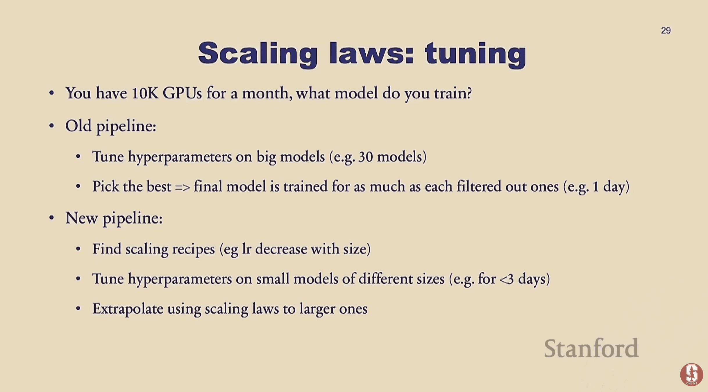

I'm taking a an AI Engineering course and capturing some notes and resources as a go.
This week I was trying to understand how tokenizers handle multi-byte characters, like emojis and Chinese characters.

## Tokenizers

Modern LLM tokenizers like BPE typically handle multi-byte characters in one of two main ways:

### Byte-Level BPE (Most Common)

The most popular approach, used by GPT-2/3/4 and many others, operates directly on bytes rather than characters:

* **UTF-8 encoding first**: Multi-byte characters like 🤖 or 漢 are first encoded into UTF-8 bytes
* **Byte-level vocabulary**: The tokenizer treats each byte (0-255) as a base unit
* **Merges learned from data**: BPE then learns common byte sequences from training data

Example: The emoji 🤖 encodes to 4 UTF-8 bytes: `F0 9F A4 96`

These might initially be 4 separate tokens
If this emoji is common in training data, these bytes might merge into a single token
If it's rare, it stays as multiple byte tokens

### Advantages of Byte-Level Approach

Universal handling: Can represent any UTF-8 text, even invalid unicode
Fixed vocabulary size: Only 256 base bytes plus learned merges
No unknown tokens: Everything can be encoded somehow

### The Challenge

Multi-byte characters often get fragmented:

* Common Latin characters: usually 1 token
* Kanji/Chinese characters: often 2-3 tokens each
* Emojis: typically 1-4 tokens

This creates inefficiency for non-English text

### Modern Improvements

Newer tokenizers address this:

* GPT-4's tokenizer: Better merges for common CJK characters and emojis
* SentencePiece (used by LLaMA, T5): Can work at character level with normalization
* Training on diverse multilingual data helps the model learn useful merges for common multi-byte sequences

The key insight is that byte-level BPE is language-agnostic but can be inefficient for scripts that use many bytes per character.

## Scaling LLMs

There's a [section of the Stanford CS229 course lecture](https://youtu.be/9vM4p9NN0Ts?si=utbIHw7q7_W4Ckcp&t=2697) on scaling LLMs that deals with a specific question:

> You have 10K GPUs for a month. Which model should you train?

The concept count is high, but it's a practical example of how companies building LLMs make decisions about model size and training time.

## Resources

Collecting linked resources from Week 1 of the AI Engineering Course from ByteByteAI.

* AI Index: State of AI in 13 Charts: https://hai.stanford.edu/news/ai-index-state-ai-13-charts

### Training Data Sources

* Does Anthropic crawl data from the web, and how can site owners block the crawler?: https://support.anthropic.com/en/articles/8896518-does-anthropic-crawl-data-from-the-web-and-how-can-site-owners-block-the-crawler
* GPT2 paper: https://cdn.openai.com/better-language-models/language_models_are_unsupervised_multitask_learners.pdf
* Common Crawl: https://commoncrawl.org/
* Tensorflow C4: https://www.tensorflow.org/datasets/catalog/c4
* HuggingFace C4: https://huggingface.co/datasets/allenai/c4
* Dolma: https://huggingface.co/papers/2402.00159
* Dolma paper: https://arxiv.org/pdf/2402.00159
* RefinedWeb: https://arxiv.org/abs/2306.01116
* FineWeb: https://huggingface.co/spaces/HuggingFaceFW/blogpost-fineweb-v1

### Controlling Data Inputs

* URL filtering blocklist: https://dsi.ut-capitole.fr/blacklists/

### Tokenization

* Byte Pair Encoding (BPE):
  * BPE visualization: https://process-mining.tistory.com/189
  * HuggingFace BPE: https://huggingface.co/learn/llm-course/en/chapter6/5
* HuggingFace Llama3: https://huggingface.co/docs/transformers/en/model_doc/llama3
* Tokenization
  * Tiktokenizer: http://tiktokenizer.vercel.app/
  * Tiktoken library: https://github.com/openai/tiktoken

### Transformers

The heart of modern LLM.

* Attention is All You Need: https://arxiv.org/abs/1706.03762
* The illustrated Transformer: https://jalammar.github.io/illustrated-transformer/
* Llama 3 paper: https://arxiv.org/abs/2407.21783

### Fine Tuning

* Instruction tuning datasets: https://huggingface.co/collections/mapama247/instruction-tuning-datasets-65ddec58a16a00a4c84e5cf1
* Training language models to follow instructions with human feedback: https://arxiv.org/abs/2203.02155
* Alpaca: https://huggingface.co/datasets/tatsu-lab/alpaca
