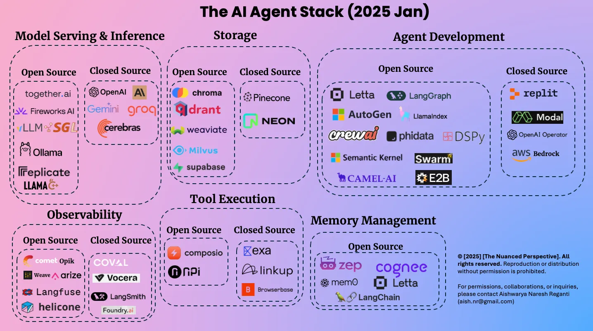

## Defining Agents

> TIP: The [accompanying project code](https://github.com/bytebyteai/ai-eng-projects/tree/main/project_3) is helpful to see many of these concepts in action.
> I also paired with Claude to create a [sample MCP client and server](https://github.com/dvhthomas/mcp_demo) to help me understand how the plumbing works.

### LLMs are static

LLMs are static based on a body of knowledge.
They don't have autonomy or agency to plan, perform actions.
For a next token predictor answering something like _'Write an email to my boss to take one day off'_ might return a good result. But _'Write a full report on the housing marketing and share existing opportunities'_ is going to miss expectations.

We can use [RAG]() to augment content, and fine-tuning to make them more domain-specific.
The there are limits to the complexity of task that even a fine-tuned, RAG-augmented model can handle on their owfn.

Our goal is **to make LLMs more capable**.

* "How's the weather in San Francisco today?" > LLM > `+ Weather API`
* "What is 1234532 + 56528" > LLM > `+ Calculator`
* "Where is my order?" > LLM > `+ Database access`
* "Who scored in the Barcelona game today?" > LLM > `+ Web search`
* "What is your refund policy?" > LLM > `+ RAG`

### Definition

An agent is[^def]:

> A software system that uses LLM(s) to pursue goals and
> complete tasks on behalf of users.
> They plan, reason, call tools, and rely on memory to complete complex tasks.


An agent is a system of software components


Agents have autonomy; LLMs don't.
Agentic systems have different levels of agency.

1. Simple processor
2. Workflows
3. Tool caller
4. Multi-step agents
5. Multi-agent systems

### Types of Agent

Let's talk a little more about each of those 5 agent levels.

#### Simple Processor Agents

This is seen less as an agent than a simple piece of sofware.
Even thought it may be 'simple' in the agentic sense, there are typically many back-and-forth calls between software and LLM.
And there's more happening in the loops like tokenizations, response templating, and prompt engineering in general.



#### Workflow Agents

This is where the predefined code paths are designed offline using some kind of orchestrator.
At runtime, the LLM is not asked to plan.
The benefit is more determinism.



Common workflow patterns:

##### Prompt chaining

A single prompt can overwhelm the token limits and complexity that the LLM can handle.
It can also lead to hallucination.
Something like _Analyze housing market, summarize the results, etc etc..."_ needs to be decomposed into smaller tasks.
Something like this for a `user query`:

1. **Prompt 1**: analyze housing market specific in `{user query}`
2. **Prompt 2**: summarize findings in `{output}`

   The ONLY thing it does is summary. Much simpler!
3. **Prompt 3**: Identify trends in `{output2}`

   Again, a focused task.
4. **Prompt 4**: Share opportunities given `{output1}` and `{output2}`

Prompt chaining is where a task can be **easily decomposed**.
It's a tradeoff between accuracy and latency.
Good examples might be:

- **Content generation** (writing a docuemnt outline -> checking the outline -> write the document).
- **Data extraction** like converting unstructured text into a structured format.
- **Information processing** with transform1, transform2, transform3, etc.

##### Routing

> TIP: There's some example code in my [agent-learn/2-routing-pattern](https://github.com/dvhthomas/agent-learn/tree/main/2-routing-pattern) repo.

This goes beyond deterministic steps and we **introduce conditional logic**.
Really two key steps:

1. Determine the intent of the user prompt.
2. Route the prompt to the appropriate LLM.

Routers could be one of the following types:

- Rule based (if/else)
- ML-based: Use a traditional ML model that can determine the path: classifier model (`A or B`)
- Embedding similarity: `query -> embedding -> nearest specialized embedding`.
  This is useful for _semantic_ routing.
- LLM Routers: Just prompt the LLM to classify the intent in a deliberately structured way.

Routers are commonly used for efficiency.
For example, you could send common or simple questions to smaller and cheaper models, whereas you could send complex questions to larger and more expensive models.



Here's the key: the decision logic for routing **does not** have to be an LLM!
It could even be human in the loop.

##### Reflection

> TIP: There's some example code and a detailed README in my [agent-learn/4-reflection](https://github.com/dvhthomas/agent-learn/tree/main/4-reflection) repo.

This is also called Evaluator-Optimizer.
The Evaluation is also called **a Critic**.
There's no way that a Router could figure this out: we're entering a loop until the Critic is satisfied.

In practice, it's ofter more effective for a specialized LLM so that you avoid feedback bias in the Critic.

Reflection is good when there are **clear evalution criteria** and where **iterative refinement helps**.
Code generation is a great example.
The Critic could write tests to assess and then ask the Generator to iterate on the code.

##### Parallelization



##### Tool Caller

> TIP: I've [written a bunch of examples](https://github.com/dvhthomas/agent-learn/tree/main/5-tool-use) of the tool-caller pattern.




Tool calling workflow:

1. Define a Tool
2. Let LLM know about the tool
3. When the LLM wants to use it, call the tool and return the response.

One way to let the LLM know about a tool is to define it in the system prompt. The key is to have the LLM spit out a structured format that the Agent can recognize:

* System Prompt:

  ```txt
  You can use a tool called add to add two numbers. It takes two inputs: number 1 and number 2. It returns their sum. Use it like this:

  <tool>
    add(number1, number2)
  </tool>

  Just replace number1 and number2 with the numbers you want to add.
  ```
* User prompt:

  ```txt
  What is 184322 + 54821?
  ```

* Response:

  ```txt
  <tool>
  add(184322, 54821)
  </tool>
  ```

Add this point the Agent Software can recognize the format of the response and can call an appropriate existing tool. In this case it might be a Python tool with an `add(n1, n2)` signature, or even [have the LLM write a function](https://github.com/dvhthomas/agent-learn/blob/main/5-tool-use/code_exec.py).
LangChain makes [tool integration pretty easy](https://python.langchain.com/docs/how_to/function_calling/).

But this isn't scalable: jamming stuff into a system prompt is non-standard, impossible to maintain, and leads to brittle code.

**Model Context Protocol (MCP)** is the new standard for tool integration.
It's a protocol.
The service provider writes the tool functions once and exposes them as an MCP-compliant server to broad consumption.



You introduce the MCP Servers to your LLM through a standard mechanism and protocol.



This is more maintainable: adding a new tool is as simple as adding a new server to the MCP `server.json`. See [GitHub MCP Registry](https://github.com/mcp) for a searchable list of available MCP servers.

If you revisit Workflows and plug in the tools concept, everything becomes more maintainable and scalable and flexible.
Imagine that the Tools in this workflow are augmenting the system and user prompt as data flows through the system.



This **fixes** the issues of access of current information.

#### Multi-step agents

Solves the problem of fixed workflows by giving decision-making authority to the agent.



Making good decisions involves access to **both** tools **and** memory of what happened before.
We've covered the tools.
Memory is for storing and observing past interactions as additional context.

Logically this is a continuous Planning cycle consisting of think, act, observe:


graph LR
    T[Think] --> A[Act] --> M[Observe]
    M --> T



Pseudo-prompt:

```txt
Thought: I need to check the current weather for New York.
Action:
{
    "action": "get_weather",
    "action_input": {
        "location": "New York"
    }
}
Observe: I got the answer "<result>34F</result>"
```

Anthropic's [Building Effective Agents Cookbook](https://github.com/anthropics/claude-cookbooks/tree/main/patterns/agents) is a key resource to understand these patterns ([example](https://github.com/anthropics/claude-cookbooks/blob/main/patterns/agents/orchestrator_workers.ipynb)).
For example, [their prompts for research agents](https://github.com/anthropics/claude-cookbooks/tree/main/patterns/agents/prompts) demonstrate how to instruct the LLM to act in specific ways, including being critical of tool results (_"...do not take tool results at face value..."_) and watching out for information pointing to future (looking for 'could' 'maybe' 'future' in search results).

There's a lot of prompt engineering going in here (look for `<tags>` in prompts).

There are different approaches to `plan > act > adapt`.
[ReACT (2023)](https://arxiv.org/abs/2210.03629) is probably the most popular approach as of October 2025.
It's just a prompting technique.



Other papers describing how to implement this `think > plan > act` loop:

- [Reflexion](https://arxiv.org/abs/2303.11366) - Reflexion: Language Agents with Verbal Reinforcement Learning
- [ReWOO](https://arxiv.org/abs/2305.18323) - ReWOO: Decoupling Reasoning from Observations for Efficient Augmented Language Models
- [Tree Search for Language Model Agents](https://arxiv.org/abs/2407.01476) - Research on using tree search algorithms for improved agent planning and decision-making

In summary, workflows vs multi-step agents:

* Workflows offer predictability and consistency for well-defined tasks, whereas agents are the better option when flexibility and model-driven decision-making are needed at scale.
* Agents can adapt to new situations, like answering a customer’s unique question. Workflows are rigid, better for repeating the same process, like scheduling maintenance.

When evaluating whether to use multi-step agents:

* The autonomous nature of agents means **higher costs**, and the potential for compounding errors.
* Challenging due to their dynamic nature. They can be unreliable, illogical, or prone to infinite loops,
* When a problem's solution is already well-understood and repeatable, constraining the agent to a predetermined, fixed workflow is more effective
* Agents can be used for open-ended problems where it’s difficult to predict the required number of steps, and where you can’t hardcode a fixed path.

#### Multi-agent system

Single agent may not be capable or the problem is too complex for a single agent.
On agent may fail or move in an incorrect direction, so multi-agent systems can self correct.

This is not easy!
Common challenges include:

* Coordination. Sharing planning, results.
* Memory management. When to share, when to isolate.
* Compounding errors. The inherent loop means errors can be amplified.

The [Anthropic multi-agent research system](https://www.anthropic.com/engineering/multi-agent-research-system) is a good read that shows the level of effort.
[OpenAI has shared a practical guide](https://cdn.openai.com/business-guides-and-resources/a-practical-guide-to-building-agents.pdf) that covers design patterns.

The coordination between agents led Google to defined and [release](https://developers.googleblog.com/en/a2a-a-new-era-of-agent-interoperability/) the Agent To Agent (A2A) protocol.
Agents can communicate regardless of who built them.
A2A is to inter-agent communication what MCP is to tool sharing.

**How do you evaluate agents?**

Things to thing about:

* Accuracy: How well does the agent achieve its goal?
* Efficiency: How quickly does the agent achieve its goal?
* Robustness: How well does the agent handle unexpected inputs or changes in the environment?
* Safety: How well does the agent avoid harmful actions or outcomes?
* Fairness: How well does the agent treat different groups or individuals?

 Some common metrics include:

* METRIC: Token consumption, e.g., avg token usage per request.
* METRIC: Tool execution success rate.
* METRIC: Observability. How easily can you even find errors.
* METRIC: Task success rate.


## The AI Agent Stack

This came from [a Jan 2025 post][stack] and nicely summarizes a lot of the tooling options so that you don't think you have to build everything from scratch!



[source][stack]

## Resources

- [Introducing Operator](https://openai.com/index/introducing-operator/) - OpenAI's AI agent that can autonomously perform tasks through a web browser
- [Building effective agents](https://www.anthropic.com/engineering/building-effective-agents) - Anthropic's guide on practical patterns and best practices for developing AI agents
- [Building Effective Agents Cookbook](https://github.com/anthropics/anthropic-cookbook/tree/main/patterns/agents) - Anthropic's cookbook repository with code examples for agent patterns
- [Function calling](https://cookbook.openai.com/examples/fine_tuning_for_function_calling) - OpenAI Cookbook guide on fine-tuning models for improved function calling accuracy
- [Langchain tools](https://python.langchain.com/docs/integrations/tools/) - Comprehensive directory of tool integrations available in the LangChain framework
- [MCP](https://www.anthropic.com/news/model-context-protocol) - Introducing the Model Context Protocol, an open standard for connecting AI assistants to data sources
- [Langchain function calling](https://python.langchain.com/docs/how_to/function_calling/) - LangChain documentation on implementing tool and function calling
- [ReAct paper](https://arxiv.org/abs/2210.03629) - ReAct: Synergizing Reasoning and Acting in Language Models
- [Reflexion](https://arxiv.org/abs/2303.11366) - Reflexion: Language Agents with Verbal Reinforcement Learning
- [ReWOO](https://arxiv.org/abs/2305.18323) - ReWOO: Decoupling Reasoning from Observations for Efficient Augmented Language Models
- [Tree Search for Language Model Agents](https://arxiv.org/abs/2407.01476) - Research on using tree search algorithms for improved agent planning and decision-making
- [How we built our multi-agent research system](https://www.anthropic.com/engineering/multi-agent-research-system) - Anthropic's engineering deep-dive on building production multi-agent systems
- [A practical guide to building agents](https://cdn.openai.com/business-guides-and-resources/a-practical-guide-to-building-agents.pdf) - OpenAI's comprehensive guide for product and engineering teams on agent development
- [A2A](https://developers.googleblog.com/en/a2a-a-new-era-of-agent-interoperability/) - Announcing the Agent2Agent Protocol for enabling AI agents to collaborate across platforms
- [A survey of AI agents protocol](https://arxiv.org/abs/2504.16736) - Academic survey analyzing existing agent communication protocols and standards
- [Agent leaderboard](https://github.com/rungalileo/agent-leaderboard) - Ranking LLMs on agentic tasks across real-world business scenarios
- [OpenAI Agent SDK](https://openai.github.io/openai-agents-python/) - OpenAI's Python SDK for building production-ready agentic AI applications

## Agentic Tool Stack Jan 2025

[source][stack]

### Model Serving & Inference

* Open Source
  * together.ai - https://www.together.ai/
  * Fireworks AI - https://fireworks.ai/
  * LLMSG - https://llm.sg/
  * Ollama - https://ollama.com/
  * replicate - https://replicate.com/
  * LLAMA - https://llama.meta.com/

* Closed Source
  * OpenAI - https://openai.com/
  * Anthropic (AI logo) - https://www.anthropic.com/
  * Gemini - https://gemini.google.com/
  * groq - https://groq.com/
  * cerebras - https://www.cerebras.net/

### Storage

* Open Source
  * chroma - https://www.trychroma.com/
  * drant - https://qdrant.tech/
  * weaviate - https://weaviate.io/
  * Milvus - https://milvus.io/
  * supabase - https://supabase.com/

* Closed Source
  * Pinecone - https://www.pinecone.io/
  * NEON - https://neon.tech/

### Agent Development

* Open Source
  * Letta - https://www.letta.com/
  * LangGraph - https://www.langchain.com/langgraph
  * AutoGen - https://microsoft.github.io/autogen/
  * LlamaIndex - https://www.llamaindex.ai/
  * crewai - https://www.crewai.com/
  * phidata - https://www.phidata.com/
  * DSPy - https://dspy-docs.vercel.app/
  * Semantic Kernel - https://learn.microsoft.com/en-us/semantic-kernel/
  * Swarm - https://github.com/openai/swarm
  * E2B - https://e2b.dev/
  * CAMEL-AI - https://www.camel-ai.org/

* Closed Source
  * replit - https://replit.com/
  * Modal - https://modal.com/
  * OpenAI Operator - https://openai.com/index/introducing-operator/
  * aws Bedrock - https://aws.amazon.com/bedrock/

### Tool Execution

* Open Source
  * composio - https://composio.dev/
  * nPi - https://npi.ai/

* Closed Source
  * exa - https://exa.ai/
  * linkup - https://www.linkup.so/
  * Browserbase - https://www.browserbase.com/

### Observability

* Open Source
  * comet Opik - https://www.comet.com/site/products/opik/
  * Weave - https://wandb.ai/site/weave/
  * arize - https://arize.com/
  * Langfuse - https://langfuse.com/
  * helicone - https://www.helicone.ai/

* Closed Source
  * COV.AI - https://www.cov.ai/
  * Vocera - https://vocera.ai/
  * LangSmith - https://www.langchain.com/langsmith
  * Foundry.ai - https://www.foundry.ai/

### Memory Management

* Open Source
  * zep - https://www.getzep.com/
  * cognee - https://www.cognee.ai/
  * mem0 - https://mem0.ai/
  * Letta - https://www.letta.com/
  * LangChain - https://www.langchain.com/

[^def]: See [Hugging Face's introductory course](https://huggingface.co/learn/agents-course/en/unit1/what-are-agents):

[stack]: https://thenuancedperspective.substack.com/p/the-ai-agent-stack-in-2025-how-its
