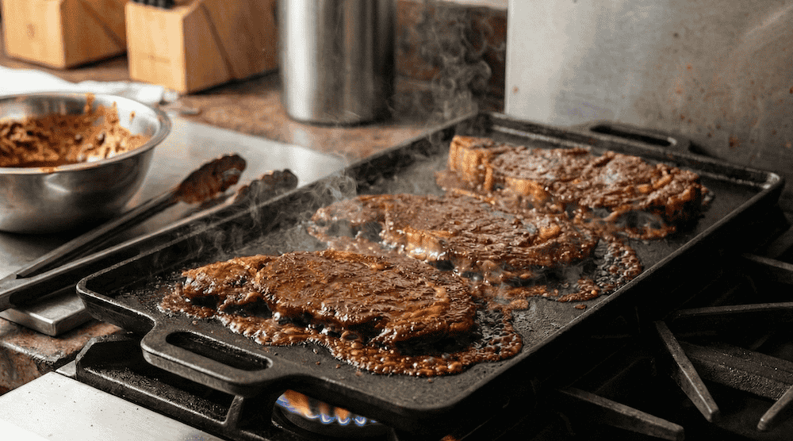

See Tips for picking the right beef.



### Ingredients


- 2 lb meat, about 4 medium ranchero steaks.
- 3 cloves garlic
- 1 cup cilantro leaves
- 2 scallions
- 2 limes, zest and juice
- 1 orange, zest and juice
- Cumin 2.5 tsp
- Oregano (dried)
1 chipotle chile with 1 tbsp adobo sauce


### Instructions


**Prepare marinade:** In a food processor or blender, blend cilantro, chile, adobo sauce, scallions, garlic, lime zest and juice, orange zest and juice, oil, Worcestershire, cumin, salt, and pepper until smooth.

**Marinade steak:** Place steak into a large resealable bag and pour marinade over.
Press as much air out of bag as possible and massage marinade into steak.
Refrigerate **at least 4 hours** or up to overnight.

**Cook:** Preheat and lighlty oil either a hot grill (BBQ) or stovetop with hot cast-iron flat top or very large skillet.
Remove the steaks and let most of the marinade drip off.
Place on the cooking surface, ensuring that each steak has room to cook without touching other steaks.
Cook for ~2-3 minutes on each side.

**Rest and serve:** Let the steaks rest for 5 minutes.
For tacos, slice the steaks across the grain into thin  (1/2 inch or 1 cm) strips.
Optionally, cut again into bite-sized pieces.
Serve on tacos.



### Notes

**Storage:** Will keep overnight in an airtight container but can only be reheated once.
Honestly much better fresh.

**Variations:** Ideas for substitutions or alternative ingredients.

**Tips:**
- Skirt steak or flank steak is a common choice but the American version of these cuts are cut too thick.
  Head over to the Mexican market and pick up either ranchero ([flap steak](https://en.wikipedia.org/wiki/Flap_steak)), or tasajo, diesmillo.
  They’re butchered extremely thin because the meat is to be cooked through.
- Turn your extractor fan to high!
  This is a very smokey cooking process and you fire alarm *will* go off unless you have your kitchen extractor fan on full blast.
- Adobo sauce is a tangy Mexican sauce made from a blend of dried chili peppers, vinegar, garlic, and spices.
  It's the sauce used to pack canned chipotle peppers in adobo sauce.
  You can easily find it in most grocery stores in the Mexican food aisle.
  In this recipe we use 1 of the chillis and some of the actual adobo sauce.


