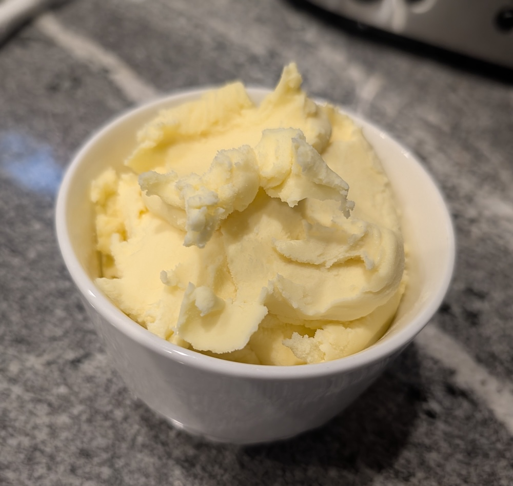
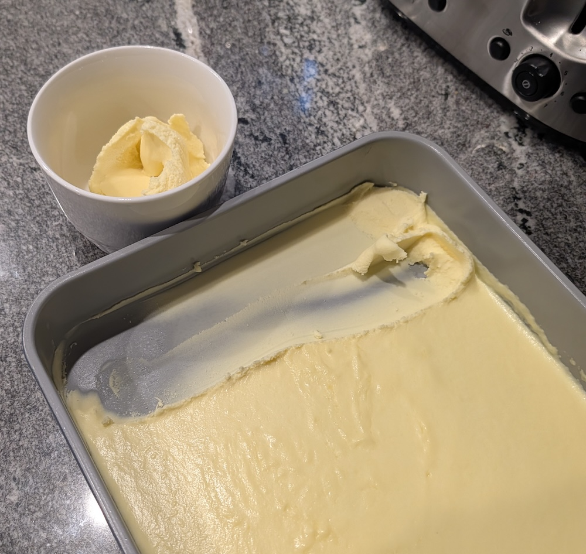

The [original recipe](https://theviewfromgreatisland.com/stove-top-clotted-cream-recipe/) has many alternative methods for making clotted cream.
This is by far the easiest and quickest method.



### Ingredients


- 3 cups (710 ml) heavy cream
- 2 tbsp unsalted butter


### Instructions



**Reduce the cream:** Put the cream and butter into a medium sized heavy bottomed pan and heat to a gentle boil, stirring often so the cream does not scorch.
Gently boil the cream, stirring often, until it is reduced by at least 1/3.
This may take up to 30 minutes, depending on your pan, and the heat of your burner.

**Cool and set:** As the cream cooks down it will thicken, almost like a custard, and will coat the back of a spoon.
Pour the cream into a shallow baking pan to cool.
Put it in the refrigerator for several hours or overnight.

**Serve:** Allow the clotted cream for warm up for 30 minutes.
Use a soft spatula to scrape the cream into a serving dish.



### Notes

**Storage:** Store in a lidded glass or ceramic dish in the refrigerator for up to 10 days.

**Tips:**
- Less is better.
  We took it too far the first time: our reduced cream could be scraped with a spatula to reveal the bottom of the saucepan for a second.
  In future we'll take it off the heat a little sooner while is still more liquid than custard.
  That way, the set (refrigerated) cream will be softer and easier to spread.
- Heavy pan. We use an [All-Clad stock pot](https://www.all-clad.com/d5-stainless-polished-5-ply-bonded-cookware-soup-pot-with-lid-4-quart.html) because they're so good at distributing heat evenly.
  It's really easy to scorch the cream in a thin or lightweight pan.


