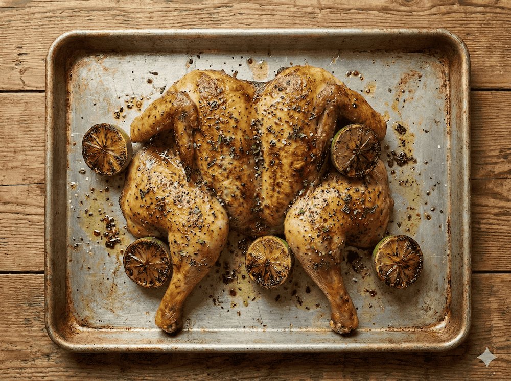

I saw this on [the Dish podcast](https://youtube.com/shorts/2RSMjPljWsg?si=twL2TaHfEFnh3pdL).
The [source recipe](https://www.waitrose.com/ecom/recipe/roast-spatchcock-chicken-with-coriander-red-chilli-and-charred-limes) has bold flavor, and is great with potatoes and peas.



### Ingredients


- 1/2 x 100g pack cilantro, roughly chopped
- 25g pack mint, leaves roughly chopped
- 6 garlic cloves, crushed
- 30g fresh root ginger, finely chopped (about 30g)
- 2 red chillies, finely chopped
- 5 limes, zest and juice of 3, 2 halved
- 1 tbsp soy sauce
- 2 tbsp sunflower oil
- 1 large chicken (about 1.8kg or 4 lbs)
- 160ml can coconut cream (2/3 cup)
- 150ml fresh chicken stock (2/3 cup)


### Instructions



**Create marinade:** Put **1/2** of the cilantro leavers, mint, and **all** of the garlic, ginger, chillies, lime zest and lime juice, soy sauce, 1 tbsp oil and 1 tbsp water into the blender. Add salt and pepper then blend to rough paste.

**Spatchcock the chicken:** [Spatchcocking](https://www.youtube.com/shorts/yYhtikmtEWs) just means removing the backbone and flattening the bird.
Use kitchen scissors to remove the backbone.
Flatten the chicken, using enough force to break the breast bone so that it likes flat and stays flat.
Tie the legs together with butcher's twine.

**Season:** Salt and pepper the chicken all over: both sides! Rub the marianade all over the bird. Top and bottom! Put on a rimmed sheet pan and refrigerate uncovered for 1 hour.

**Roast:** Preheat the oven to 350°F (180°C).
Put the remaining 1 tbsp oil in a half-size (18 x 13 inches) sheet pan over a medium heat on the stovetop / hob.
Brush off and reserve the excess marinade from the chicken then place it **breast side down** on the sheet pan.
Add the lime halves, flesh-side down, and cook for 5 mins to develop some color and crispiness on the skin.
Flip the chicken over, **breast side up**, rub with a bit of the excess marinade, remove the lime halves, and roast for 45 mins to 1 hour until cooked through.

> INFO: Remove your roast chicken from the oven when the thickest part of the breast reads around 150-160°F (65-71°C), as carryover cooking will raise it to the safe 165°F (74°C) during 15 minutes of resting, preventing dry chicken.

**Sauce and serve:** Transfer the chicken to a board, breast-side up, and loosely cover with foil; rest for 20 minutes.
Set aside the lime halves. Put the roasting tin over a medium heat and add the reserved 2 tbsp marinade, coconut cream and chicken stock.
Stir through until bubbling; season.
Transfer the chicken to a warm serving platter with the limes and scatter over the remaining herbs. 
Carve and serve with the sauce.



### Notes

**Storage:** Like any roast chicken, this is good for several days in an airtight, refrigerated container. I personally like to eat it cold.

**Tips:** I use half size [sheet pans](https://en.wikipedia.org/wiki/Sheet_pan) for roasting chickens. That's ~18 x 13 inches. If you want to roast vegetables in the same pan, use a high-sided roasting tin instead.


