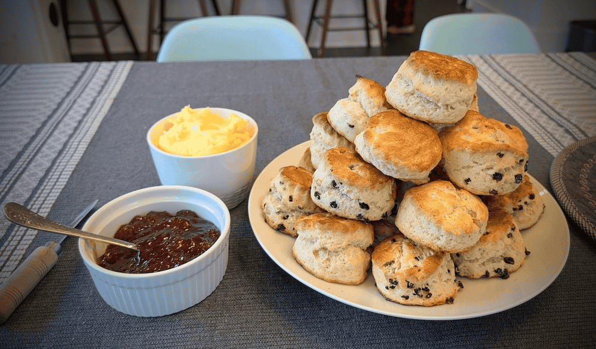

See [the original recipe](https://www.fifteenspatulas.com/english-style-scones/) for more details.
If you have 3 cups of heavy cream, try making some clotted cream to smear on top with strawberry jam.



### Ingredients


- 2 cups all-purpose flour (10 ounces by weight)
- 4 tsp baking powder
- 1/2 tsp salt
- 1/4 cup sugar
- 6 tbsp unsalted butter at room temperature
- 2/3 cup whole milk
- 1 large egg


### Instructions



Preheat the oven to 425 degrees F.

**Build the dough:** In a food processor, pulse the flour, baking powder, salt, and sugar a couple times to combine.
Add the butter and pulse 7-10 times until the butter is completely distributed.
You shouldn’t see any chunks of butter, and the mixture should have a sandy texture to it.

**Add wet ingredients:** Transfer to a large mixing bowl.
In a small bowl, whisk to combine the milk and egg.
Save 2 tbsp of it for the egg wash later, and pour the rest into the mixing bowl with the dry ingredients.
Stir to combine with a spatula, until a rough dough forms.

**Form the dough and cut the scones:**Transfer to a lightly floured countertop and knead about 10 times until the dough comes together into a relatively smooth ball.
Take care not to knead too much, or the dough will be tougher and not rise as high.
Roll the dough about an inch thick and use a 2.5 inch cutter to cut about 7 circles.
Re-roll the scraps and cut out another 2.

**Bake:** Place the scones onto a parchment or silicone mat lined baking sheet and brush the tops with the reserved egg wash.
Bake the scones for 13-15 minutes, until about tripled in height, and golden brown on the tops and bottoms.



### Notes

**Storage:** An airtight container at room temperature for up to 3 days.
But they never last that long.

**Variations:** Hold the currents if you don't like the dried fruit taste.

**Tips:** If your baking powder is older than 6 months, ditch it and buy new. It'll affect the rise.


