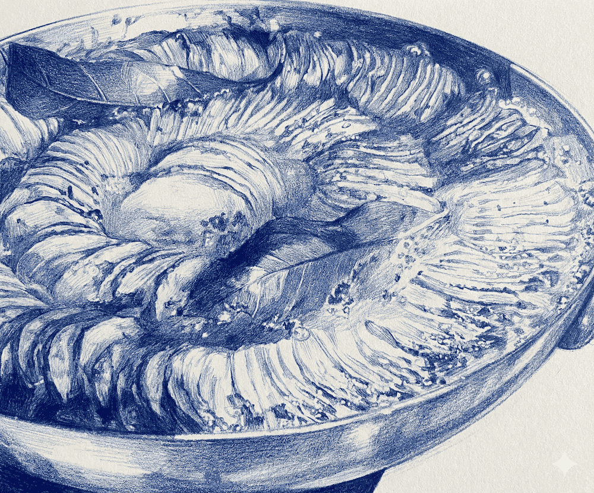



### Ingredients


- 6 medium potatoes
- 1 stick salted butter
- 1 white onion, sliced
- Bay leaves
- 1 cup chicken stock
- Salt and pepper to taste


### Instructions



**Preheat the oven:** 350F (180C)

**Cooking the onions:** Slowly sweat and cook down the finely sliced onion in a liberal amount of butter. Do this on the stove top in the same round oven-safe dish that you will bake the potatoes in. This will take about 10-15 minutes until they are translucent.

**Slice the potatoes:** You can either peel or leave the skin on your potatoes. I leave the skin on yellow potatoes and just give them a good scrub.
Use a mandoline set to 1mm thickness and slice all the potatoes cross-wise **not** lengthwise.

**Arrange the potatoes:** Spread the cooked onions all around the base of the dish in a thin layer. Starting from the outside of the dish, arrange the potatoes in a tight spiral towards the center of the dish. Attempt to have the potato slices standing _almost_ upright and quite tightly packed.

**Season:** Add slices of butter all over the top of the potatoes, liberally season with salt and a little pepper. Tuck 2-3 bay leaves into the potatoes then pour 1 cup of chicken stock into the dish. The stock should cover about 1/3 to 1/2 of the potatoes, not submerging them!

**Baek:** Put in the oven for up to 1 hour, and then let the dish rest for 5-10 minutes before serving.



### Notes

**Storage:** Cover and stored cooled potatoes in the fridge for up to 1 week. They are *delicious* reheated in the over for 10 minutes.

**Tips:** I use the bottom of a [9.5 inch Le Creuset domed bread oven](https://www.lecreuset.com/bread-oven/21301.html) for these and it's perfect for 4 massive---or 6 lame---servings.


