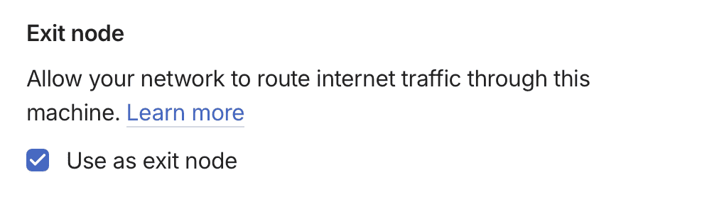

I do not want the standard user-level setup with the Tailscale GUI app setup because if the Mac power cycles, Tailscale exit node should work without a user having to log in.

Here are the steps I followed:

> INFO: These are instructions for MacOS.
> The IP forwarding in particular is OS-specific.

1. Install Tailscale on my Mac Mini by running the following command in the terminal:

    ```sh
    brew install tailscale
    ```

2. Set up Tailscale as a system service by running the following command.
  Using `sudo...` is necessary precisely because it allows the service to run without a user having to log in.

    ```sh
    sudo brew services start tailsscale
    ```

3. Set OS-level IP forwarding.
   This is something that Tailscale cannot work around: OS-level IP forwarding is required for Tailscale to function as an exit node.
   Sticking it in `/etc/sysctl.conf` makes this a persistent change.

    ```sh
    echo 'net.inet.ip.forwarding=1' | sudo tee -a /etc/sysctl.conf # IPv4
    echo 'net.inet6.ip6.forwarding=1' | sudo tee -a /etc/sysctl.conf # IPv6
    ```

4. Make the `sysctl.conf` changes one-time for the current session because I don't want to reboot.
  You could skip that and just reboot your Mac at this stage and it'll pick up the changes we made in the previous step.

    ```sh
    sudo sysctl -w net.inet.ip.forwarding=1 # IPv4
    sudo sysctl -w net.inet6.ip6.forwarding=1 # IPv6
    ```
5. Start Tailscale. Here's the magic `--advertise-exit-node` flag.

    ```sh
    sudo tailscale up --advertise-exit-node
    ```

  The first time you do this (which is now, right?!), you'll be prompted to enter your Tailscale account credentials.

6. Enable the `Exit Node` on the Tailscale dashboard at [https://login.tailscale.com/admin/machines](https://login.tailscale.com/admin/machines).

    1. You will see the _Exit Node_ label next to your machine name in the list with a little INFO icon next to it.
    2. Use the three dot (...) menu for that machine and choose _Edit Route Settings_.
    3. Click the checkbox for _Use as exit node_ and give it a few seconds to propagate.

    


With that, you can open Tailscale on another device on your tailnet, like a phone, and use your Mac as an exit node.
