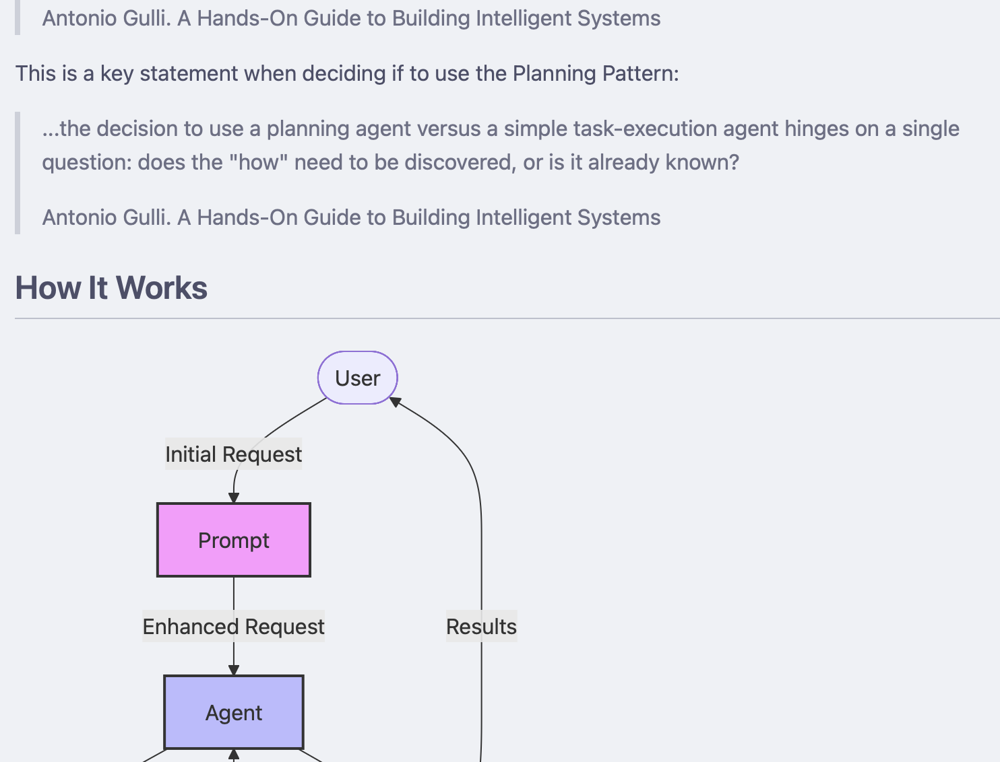

I was running `brew update` and saw a new item whiz by called [mdserve][mds].
This piqued my interest because I have been using [Zed](https://zed.dev/) as my IDE for a few weeks and have been missing markdown preview that supports [Mermaid](https://mermaid-js.github.io/mermaid/#/) diagrams.

I was particularly please to see that [mdserve][mds] is a cross-platform binary with zero dependencies.
Meaning: `brew install mdserve` will install it without me also having to install Python or Node.js or Go or Rust or...anything!

It's a no-brainer to use:

```sh
bitsbyme@bitsby % mdserve
error: the following required arguments were not provided:
  <FILE>

Usage: mdserve <FILE>

For more information, try '--help'.
bitsbyme@bitsby % mdserve README.md
📄 Serving markdown file: /Users/bitsbyme/projects/agent-learn/6-planning/README.md
🌐 Server running at: http://localhost:3000
📝 Raw markdown at: http://localhost:3000/raw
⚡ Live reload enabled - file changes will update content instantly

Press Ctrl+C to stop the server
```

Crack open the URL in your browser and enjoy a live updating preview of markdown that includes Mermaid diagrams.



There's a little theme picker in the preview web page so you can pick your light or dark theme:


[mds]: https://github.com/jfernandez/mdserve
