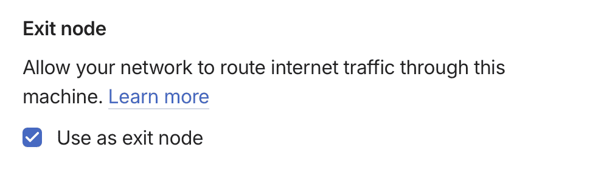

## Goals and Constraints

**Goals**:

* Enable family members to VPN into my home network so that traffic appears to be coming my home location.
* Enable family members print to our home printer, even though that printer does not---and cannot---have Tailscale installed.

**Contraints**:

1. I do not want the standard user-level setup with the Tailscale GUI app setup because if the Mac power cycles, Tailscale exit node should work without a user having to log in.
2. I want to limit access to devices on our home network to the subset that the exit node is on.

One aspect of constraint #2 is that I need to figure out the CIDR notation that we can pass to Tailscale such that the exit node is configured to let other authorized Tailscale clients access non-Tailscale devices **on the same subset** as the exit node. For example, the CIDR notation represented by `255.255.255.0` (hex `0xffffff00`) is `/24` means. That means "the first 24 bits are the network part":

```txt
# 0xffffff00 in binary:
11111111.11111111.11111111.00000000
└──────── 24 ones ───────┘└8 zeros┘
              ↓
             /24
```

That's part of what I'll be doing below

## Steps

Here are the steps I followed:

> INFO: These are instructions for MacOS.
> The IP forwarding in particular is OS-specific.

1. Install Tailscale on my Mac Mini by running the following command in the terminal:

    ```sh
    brew install tailscale
    ```

2. Set up Tailscale as a system service by running the following command.
  Using `sudo...` is necessary precisely because it allows the service to run without a user having to log in.


    ```sh
    sudo brew services start tailscale
    ```

   Now you'd have a `tailscaled` running as a system service.

3. Set OS-level IP forwarding.
   This is something that Tailscale cannot work around: OS-level IP forwarding is required for Tailscale to function as an exit node.
   Sticking it in `/etc/sysctl.conf` makes this a persistent change.

    ```sh
    echo 'net.inet.ip.forwarding=1' | sudo tee -a /etc/sysctl.conf # IPv4
    echo 'net.inet6.ip6.forwarding=1' | sudo tee -a /etc/sysctl.conf # IPv6
    ```

   > TIP: If you want to back this out, just set the values `=0` in `/etc/sysctl.conf` and reboot.

4. Make the `sysctl.conf` changes one-time for the current session because I'm too lazy to reboot.
  You could skip that and just reboot your Mac at this stage and it'll pick up the changes we made in the previous step.

    ```sh
    sudo sysctl -w net.inet.ip.forwarding=1 # IPv4
    sudo sysctl -w net.inet6.ip6.forwarding=1 # IPv6
    ```

4. Get the netmask of the exit node's IP address.

    ```sh
    # Get the
    $ ifconfig | grep "inet " | grep -v 127.0.0.1

    inet 192.168.0.9 netmask 0xffffff00 broadcast 192.168.0.255
    inet 100.81.154.9 --> 100.81.154.9 netmask 0xffffffff5.
    ```

    The first IP address `192.168.0.9` is the one you want since the second one is a Tailscale IP address.
    It includes the hex (`0x`) version of the netmask, which is `ffffff00`.
    If you know hex, that's `255.255.255.0`, or 8 bits for each number.
    In other words, the first three triplets of the IP address represent the subnet mask: $8\times3=24$
    Here's a little `bc` command that shows the math:

    ```sh
    # Convert hex FFFFFF00 to binary and count the 1s
    $ echo "obase=2; ibase=16; FFFFFF00" | bc | tr -cd '1' | wc -c
    Output: 24
    ```

    Combining the subnet mask and the IP address of the Mac that we want to be the exit node, we have a subnet mask of `192.168.0.0/24`.

5. Start Tailscale as an exit node, while also advertising the subnet:

   > INFO: The first time you do this (which is now, right?!), you'll be prompted to enter your Tailscale account credentials and do a dance in a web browser.

    ```sh
    sudo tailscale up --advertise-routes=192.168.0.0/24 --advertise-exit-node
    ```

6. Enable the `Exit Node` on the Tailscale dashboard at [https://login.tailscale.com/admin/machines](https://login.tailscale.com/admin/machines).

    1. You will see the _Exit Node_ label next to your machine name in the list with a little INFO icon next to it.
    2. Use the three dot (...) menu for that machine and choose _Edit Route Settings_.
    3. Click the checkbox for _Use as exit node_ and give it a few seconds to propagate.

    

7. Enable the subnet sharing. In the Tailscale admin dashboard, you _Edit Route Settings_ for the exit node and check the box next to the subnet mask.

With that, you can open Tailscale on another device on your tailnet, like a phone, and use your Mac as an exit node.
