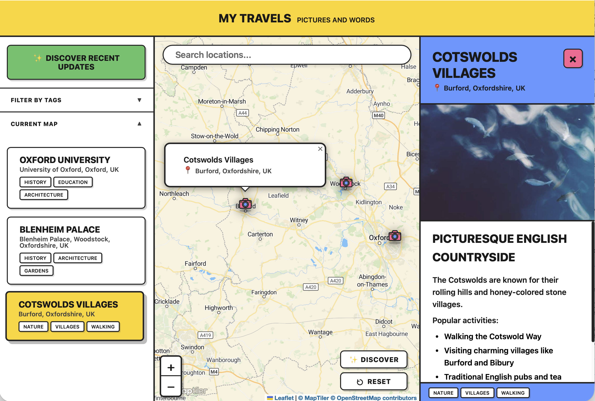
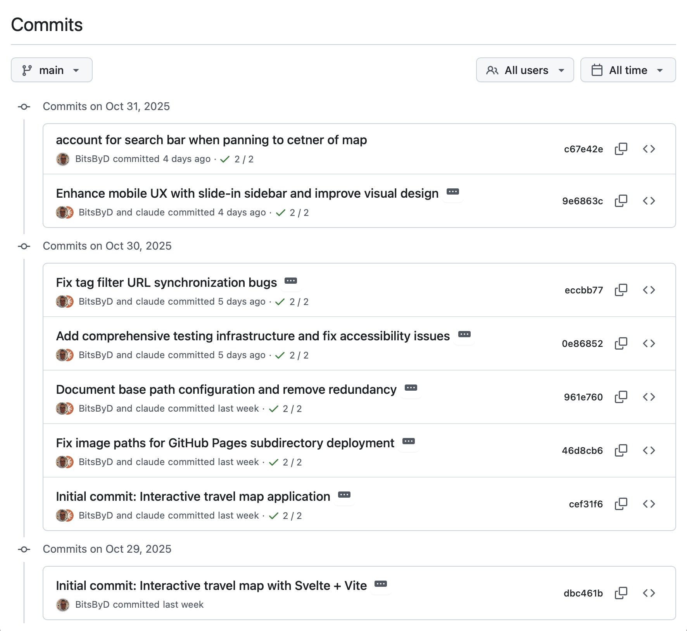
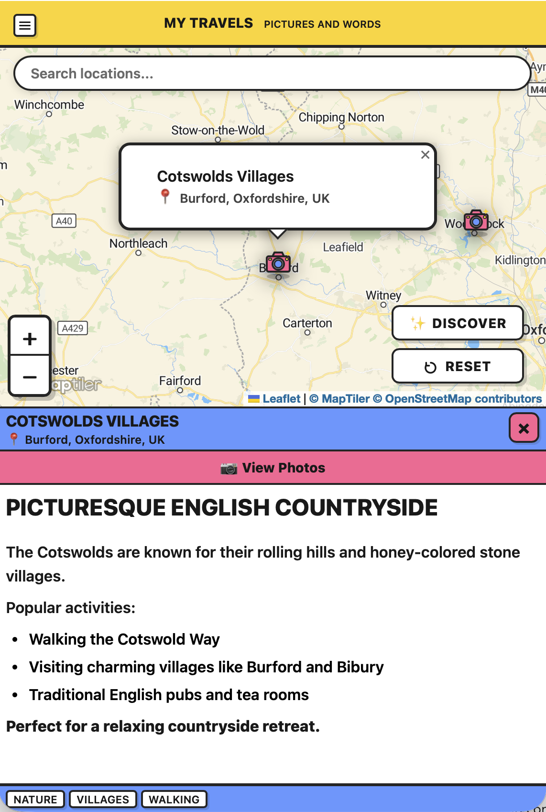

I've been wanted a little GitOps-y application where I can map out places I've been and throw a few photos in there while I'm at it.
As so many others have pointed out, the friction between me _wanting_ to do that and me _actually_ doing that is real enough where I never bothered.

Enter Claude's command line interface (CLI) as my partner in crime.
My experiment: could I create a basic application without ever writing a single line of code myself?
I was inspired  by GitHub's [idea for spec-driven development](https://github.blog/ai-and-ml/generative-ai/spec-driven-development-using-markdown-as-a-programming-language-when-building-with-ai/) but didn't want to be that formal.
Instead, I created an empty directory, `git init`-d a place to keep things, and started talking to Claude.

## Mapsicle

First, [here's the resulting app](https://dvhthomas.github.io/mapsicle/), which I called Mapsicle (like popsicle). [Source code is available on GitHub](https://github.com/dvhthomas/mapsicle/).

## Things I Learned

I'm poking around `~/.claude/` JSON files to see how the conversaion actually went, but what did I learn?

**First**, it really helps to force Claude to **keep track of decisions** in documents like a README.md. At some point pretty quickly, the token limit causes Claude (and really any agentic system) to compress the conversation and ultimately to lose context.
So my pattern was to start telling Claude to 'clearly document the decisions and knowledge that we've created in the README.md'.

**Second**, make **small changes and commit them** to Git as you go.
This is soooooo obvious but somehow in all the excitement of seeing rapid interative improvement, I kept getting bitten by not have a good checkout to roll back to.
Rookie mistake!
You can see here just how few commits I actually made, and just how gigantic the diffs were.
Eek!

**Third**, Claude is really quite remarkable at writing functional code, but it **struggles with UX and UI**.
I know I should set up a [Playwright MCP](https://github.com/microsoft/playwright-mcp) so that it knows how to regression test changes.
But even still, if I didn't know something about the DOM, HTML, and definitely about CSS, Claude would have kept spinning on radical reworks to support mobile and desktop layouts.
It's almost funny how many times I wrote: _"STOP!!!! You are making this entirely too complex. There is a simpler solution."_

Which I guess is a way of stating my **fourth** point: you still definitely, absolutely need to know the technical underpinnings of the system you're building.
There's just no reasonable way around it, IMO.
Just knowing, for example, that Leaflet maps _must_ have a hook for map container resize save me (and Claude?!) a whole lot of time fighting with redraw issues.
Because if Claude tries one more time to introduce some magic '100ms wait time to debounce', I'm going to scream...before I realize it's an agent and I just need to be more specific!

Speaking of which: here's the mobile layout after a *lot* of feedback from me.
And no, I did not write a single line of this code.

