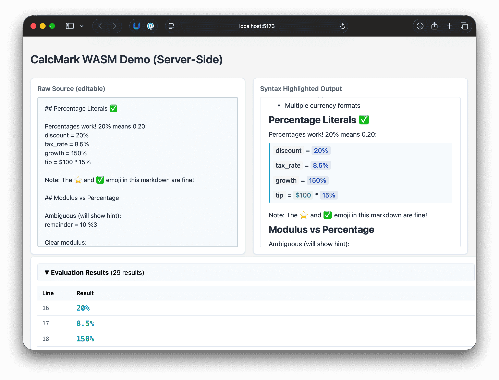
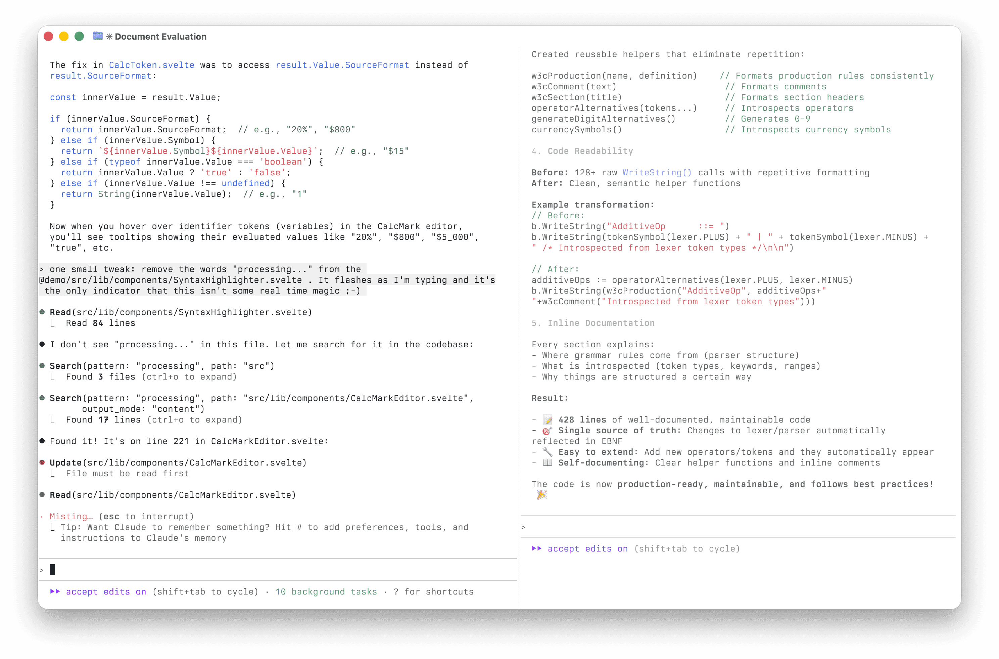

I'll have more to say about this later, but something I've longed for is a little calculator that let's me do calculations like I'm in a spreadsheet, but in the context of something like a markdown document.
If I was smarter I'd figure out how to add the `calc` language like this:

````md
This is my cool calculation with some **markdown** included!

```calc
interest_rate = 4%
loan_amount = $1,000
total = loan_amount + interest_rate
```

And here's another note with [a link](https://example.com).

````

See, it'd be embedded in markdown and support calculations how my brain works.
So I can just 'add 4%' to an amount.
The underlying math is easy, but I don't want to think about that: I just need a calculator that can do it.

So, you know, I starting thinking...
What if my new buddy Claude The Coding Genius---who has a memory like a sieve---could help me get over the hump.
I know vaguely what a domain specific language (DSL) is from back in the day messing with Hibernate Query Language (HQL) and a bajillion more recent examples.
And I know there are tokens and lexers and parsers involved.
But seriously: how hard could that be?

Well, it's 3 days later and it's almost 1:00AM and I'm tired and very excited!
Oh, and frustrated, and giddy, too.

Here's what I've got:



Dunno if you can see this, but on the left is a text editor with plain text (UTF-8 to be precise), and on the right is the result of my new CalcMark language parsing, tokenizing, lexing, and then ultimately evaluating the expressions.

I have learned **a lot** in the past 36 hours about how to actually implement a small language.
It started in Python then I got frustrated with the lack of decent compiler errors and switched to Go.
That really ratcheted up the number of errors, but in a good way.

Along the way I've been helped by Claude and immense amount but I've already remembered just how much I('ve forgotten that I) know.
Enough to forcely---and sometimes sternly---tell Claude who's boss and to stop winging it and _"Write the tests first you idiot! Just make them fail to test our hypothesis and stop writing stupid one off shell scripts!!!!"_ (then I wrote a polite version in the CLAUDE.md file!)

Here's mid-session how it's looked for a few days:



You can find the code at [CalcMark/go-calcmark](https://github.com/CalcMark/go-calcmark).
Probably the biggest areas of learning have been:

- How to thing logically about a grammar for a DSL.
  For example, how does `20%` play nice with the `%` modulo operator?
- How to [build bindings](https://github.com/CalcMark/go-calcmark/tree/main/impl/wasm) for ECMAScript and TypeScript.
  The web assembly (WASM) capabilities are Go are kind of mind blowing.
  I'm [using them](https://github.com/CalcMark/go-calcmark/tree/main/impl/wasm) in a demo Svelte app written in TypeScript and it's shockingly easy.
- How to guide a coding agent on a very non-trivial task.
  Once again the lesson of 'write it down' has become more formalized with memoized knowledge like `# Always write failing tests and run them before touching the lexer.`
- Reactivity in web apps is really hard.
  I mean, it's really simple in concept but crikey, is it hard in reality.
- Related: tell Claude to stop asking me to copy and paste `console.log` into it's memory.
  That led me to actually try a headless browser (puppeteer) and it's amazing what you can do with it.
  Actually, I haven't touched it.
  It's amazing what Claude has done with it once I told it: _"No, I'm not going to cut'n'paste another log. Spin up a headless browser and figure it out yourself."_
  So rude. So empowering.

Anyway, I'm digging this learning curve.
My optimistic plan is to turn this experiment into something that I can actually use.
Probably as a web app for capturing little calculations as they come to me.

Dunno...maybe I won't.
But in the meantime: it's late, I'm tired, I'm energized, and I'm going to let Claude take a break.
