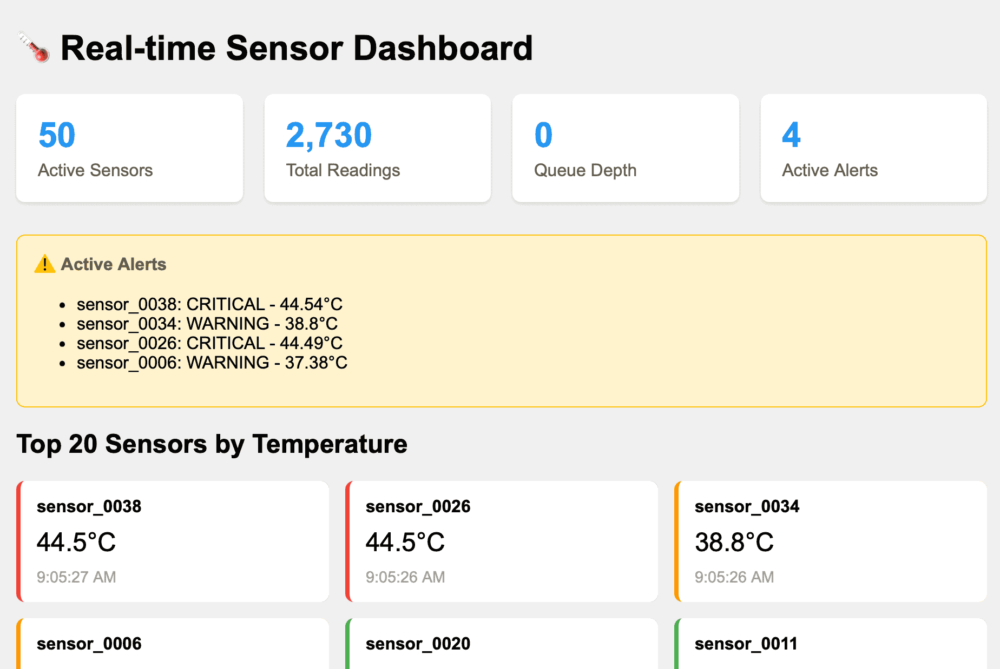

Two distinct topics for this TIL: processing data using NumPy and wiring up a basic MCP server.

## NumPy and Events

I was reading an article about [NumPy for high performance sensor data analytics](https://towardsdatascience.com/numpy-for-absolute-beginners-a-project-based-approach-to-data-analysis/).
It made me think back to my days dealing with SCADA (Supervisory Control and Data Acquisition) systems for municipal water utilities, and in some sense for in-vehicle sensor data analytics.

At first I was just curious how NumPy was doing vectorized operations, but then I thought 'where does sensor data come from?' and 'What is a simple example of an end-to-end system without spinning up Kafka?'

The result is [a codebase and Docker Compose setup](https://github.com/dvhthomas/sensor-analytics) demonstrating real-time sensor data collection, storage, and analysis using NumPy and modern data tools.
The [dashboard](https://github.com/dvhthomas/sensor-analytics/blob/main/dashboard/dashboard.py) is showing data in Redis:



## MCP

Part of my [AI Engineering course](/series/ai-engineering-course) was about tool-calling.
Since model context prototocol (MCP) is one key way that this can be implemented, I wanted to explore how to do this in the simples possible way.

Go and get the code at [dvhthomas/mcp_demo](https://github.com/dvhthomas/mcp_demo).

Here's what a session looks like:

```sh
You: What's the weather in Tokyo?


============================================================
REACT LOOP - Agent Reasoning Steps (Real-time)
============================================================

[Step 1] User Question:
------------------------------------------------------------
What's the weather in Tokyo?

[Step 2] AIMessage (ai):
------------------------------------------------------------


  Tool Calls:
    - get_weather: {'city': 'Tokyo'}

[Step 3] ToolMessage (tool):
------------------------------------------------------------
{
  "city": "Tokyo",
  "country": "Japan",
  "temperature": 7.1,
  "temperature_unit": "\u00b0C",
  "wind_speed": 4.6,
  "wind_speed_unit": "km/h",
  "weather_code": 1,
  "coordinates": {
    "latitude": 35.6895,
    "longitude": 139.69171
  }
}

[Step 4] AIMessage (ai):
------------------------------------------------------------
The current weather in Tokyo is mostly cloudy with a temperature of 7.1°C (°C). There is a gentle breeze with a wind speed of 4.6 km/h. The weather code indicates that it's a partly sunny day. If you'd like to know more about the forecast or conditions, I can try to help!

============================================================

============================================================
Final Answer: The current weather in Tokyo is mostly cloudy with a temperature of 7.1°C (°C). There is a gentle breeze with a wind speed of 4.6 km/h. The weather code indicates that it's a partly sunny day. If you'd like to know more about the forecast or conditions, I can try to help!
============================================================

You:
```

I learned about [server-sent events (SSE)](https://developer.mozilla.org/en-US/docs/Web/API/Server-sent_events/Using_server-sent_events), which is a core part of MCP:

> What it is: A web standard that enables a server to push data to a client in real-time over a single, long-lived HTTP connection.
>
> How it works: After the client initiates a connection, the server can send updates whenever new data is available without the client having to repeatedly request it.
>
> Purpose: To create live data streaming applications, such as live sports scores, stock ticker updates, and real-time notifications, making it easier to push information to a web browser.

Thankfully [FastMCP](https://gofastmcp.com/getting-started/welcome) handles this well:

```py
@mcp_server.tool(
    name=weather_definition["name"], description=weather_definition["description"]
)
async def get_weather(city: str) -> str:
    """Get current weather information for a city."""
    result = await weather_adapter.execute({"city": city})
    return json.dumps(result, indent=2)
```
