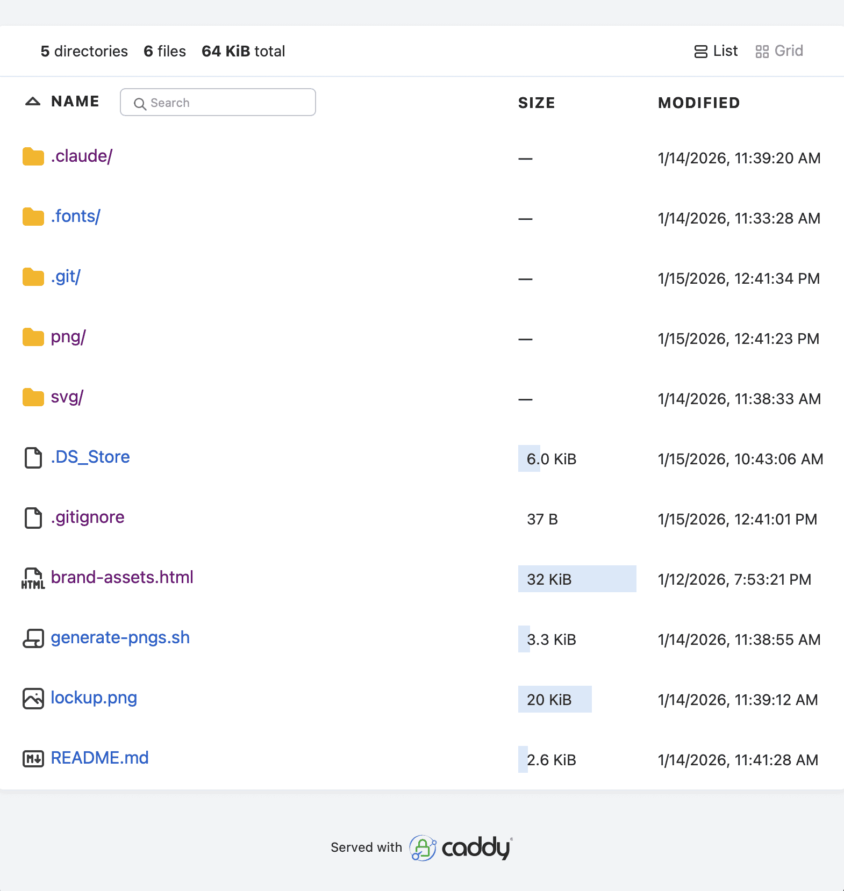
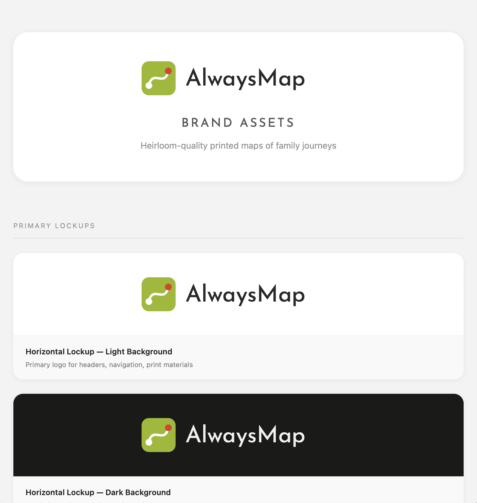

There's a good Python one-liner to start a web server in a directory:

```bash
python -m http.server 8000
```

But I also have Caddy installed and like the fact that it's an actual web server rather than a script pretending to be a web server.

Here's how I use Caddy to serve a directory (`git clone https://github.com/alwaysmap/brand`) of Web browser-friendly files on my Mac:

```bash
cd ~/directory/of/web/content
caddy file-server --browse --listen :8080
```

Now open `http://localhost:8080` in your browser to see the directory listing.
If you had an index.html file in the directory, it would be served automatically.



And clicking on the HTML file does exactly what you expect: it renders the page correctly:



Caddy can do a lot more but this is such a handy one liner that I have this in my `~/.zshrc`: `bash alias cfs="caddy file-server --browse --listen :8080"` so that I can run `cd ~/project/a && cfs`.
